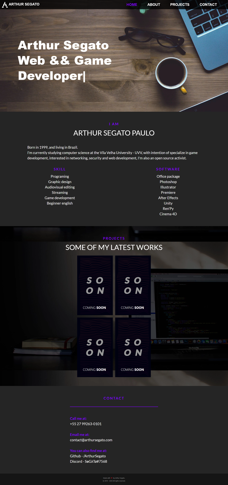

This compilation comprises some of my earlier personal website projects. Please note that the code quality might be subpar and could contain multiple bugs. Regrettably, I won't be offering any support for troubleshooting. Feel free to use it, but do so at your own risk.

I've removed all the images as I've placed this code in the MIT license.

Upon using this project, you may observe certain issues as some files are missing, leading to site breakage. I recommend adding your own files to resolve these issues.

## Screenshots:

The following screenshots show the appearance of each version

### V1

### V2

## Disclaimer

Below is a list of all the external assets used in the development of those websites with their respective licenses.

### v1

- [Montserrat](https://fonts.google.com/specimen/Montserrat) ([Open Font License](https://scripts.sil.org/cms/scripts/page.php?site_id=nrsi&id=OFL))
- [Lato](https://fonts.google.com/specimen/Lato) ([Open Font License](https://scripts.sil.org/cms/scripts/page.php?site_id=nrsi&id=OFL))
- [Muli](https://fonts.adobe.com/fonts/muli) ([Some adobe sketchy license](https://wwwimages2.adobe.com/content/dam/cc/en/legal/servicetou/Adobe_Fonts_Additional_Terms_en_US_20220715.pdf))
- [Bootstrap](https://getbootstrap.com/) ([MIT](https://github.com/twbs/bootstrap/blob/main/LICENSE))

### v2

- [Banespa and Avenida Paulista photos by Joao Tzanno](https://unsplash.com/@jtzanno) ([Unsplash License](https://unsplash.com/license))
- [Pc Monitor by Fotis Fotopoulos](https://unsplash.com/@ffstop) ([Unsplash License](https://unsplash.com/license))
- [Font Awesome Icons](https://fontawesome.com/icons) ([Font Awesome License](https://fontawesome.com/license#license))
- [Roboto](https://fonts.google.com/specimen/Roboto) ([Open Font License](https://scripts.sil.org/cms/scripts/page.php?site_id=nrsi&id=OFL))
- [True Lies](https://www.dafont.com/true-lies.font) ([Free for personal use](https://tattoowoo.com/))
- [lozard.js](https://github.com/ApoorvSaxena/lozad.js) ([MIT](https://github.com/ApoorvSaxena/lozad.js/blob/master/LICENSE))
- [Bootstrap](https://getbootstrap.com/) ([MIT](https://github.com/twbs/bootstrap/blob/main/LICENSE))

## Contributors

- [@ArthurSegato](https://github.com/ArthurSegato)
